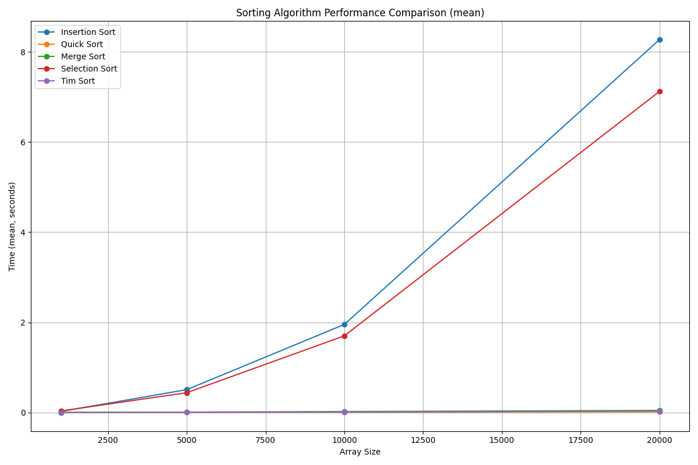

# Algorithm Implementations with Python

This repository contains Python implementations of fundamental algorithms. Each algorithm is organized into its own folder with a `.py` file, making it easy to understand and test. Testing is automated with `pytest`, and the project dependencies are managed using `poetry`.

## Algorithms

### 1. **Binary Search**
   - **Description**: Binary search is an efficient algorithm for finding the position of a target value within a sorted array. It repeatedly divides the search interval in half.
   - **How It Works**:
     - Start with the middle element of the array.
     - If the target value matches the middle element, return its index.
     - If the target value is smaller, repeat the search on the left half.
     - If larger, repeat on the right half.
   - **Big O Complexity**:
     - Time: \( O(\log n) \)
     - Space: \( O(1) \)
   - **File**: [binary_search.py](binary_search/binary_search.py)

### 2. **Sorting Algorithms**
   - **Description**: This repository includes implementations of various sorting algorithms, including Quick Sort, Merge Sort, Selection Sort, Insertion Sort, and Tim Sort.
   - **Complexity Comparison**:

   | Algorithm | Best Case | Average Case | Worst Case | Space Complexity |
   |-----------|-----------|--------------|------------|------------------|
   | Quick Sort | O(n log n) | O(n log n) | O(n²) | O(log n) |
   | Merge Sort | O(n log n) | O(n log n) | O(n log n) | O(n) |
   | Selection Sort | O(n²) | O(n²) | O(n²) | O(n) |
   | Insertion Sort | O(n) | O(n²) | O(n²) | O(1) |
   | Tim Sort | O(n) | O(n log n) | O(n log n) | O(n) |

   **Note**: Although Tim Sort shares the same worst-case time complexity as Merge Sort (O(n log n)), its constants are lower due to optimizations like using insertion sort for small runs and taking advantage of pre-existing order in the data. This makes Tim Sort significantly faster in practice, especially for real-world data that often has some inherent order.

   **Performance Comparison by Array Size**:
   
   

   - **More Details**: [Sorting Algorithms README](sorting/README.md)

### 3. **Breadth-First Search (BFS)**
   - **Description**: BFS is an algorithm for traversing or searching tree or graph structures. It explores all neighbors at the present depth before moving on to nodes at the next depth level.
   - **How It Works**:
     - Use a queue to explore nodes level by level.
     - Start at the root node and enqueue it.
     - Dequeue a node, process it, and enqueue its unvisited neighbors.
   - **Big O Complexity**:
     - Time: \( O(V + E) \), where \( V \) is the number of vertices and \( E \) is the number of edges.
     - Space: \( O(V) \)
   - **File**: [breadth_first_search.py](breadth_first_search/breadth_first_search.py)

### 4. **Dijkstra's Algorithm**
   - **Description**: Dijkstra's algorithm finds the shortest path from a source node to all other nodes in a weighted graph.
   - **How It Works**:
     - Initialize distances to all nodes as infinity, except the source node (distance = 0).
     - Use a priority queue to process the node with the smallest distance.
     - Update the distance to each neighbor if a shorter path is found.
   - **Big O Complexity**:
     - Time: \( O((V + E) \log V) \)
     - Space: \( O(V) \)
   - **File**: [dijkstras_algorithm.py](dijkstras_algorithm/dijkstras_algorithm.py)

## Testing with Pytest

This project uses `pytest` to automate testing. Each algorithm has corresponding test cases to ensure correctness. To run the tests:

1. Ensure you are in the root directory of the project.
2. Run the following command:

   ```bash
   pytest
   ```

   Or, if you're using Poetry:

   ```bash
   poetry run pytest
   ```

   For more detailed test output, use the verbose flag:

   ```bash
   poetry run pytest -v
   ```

Pytest will execute all test files in the repository and report the results.

## Managing Dependencies with Poetry

Poetry is used to manage project dependencies and virtual environments.

### Setup Instructions

1. **Install Poetry**:
   Follow the [official Poetry installation guide](https://python-poetry.org/docs/#installation).

2. **Install Dependencies**:
   Run the following command in the project directory:

   ```bash
   poetry install
   ```

3. **Activate the Virtual Environment**:
   Use the following command to activate Poetry's virtual environment:

   ```bash
   poetry shell
   ```

4. **Run Tests or Scripts**:
   Once the environment is activated, you can run scripts or tests seamlessly.

---

Happy coding and learning!