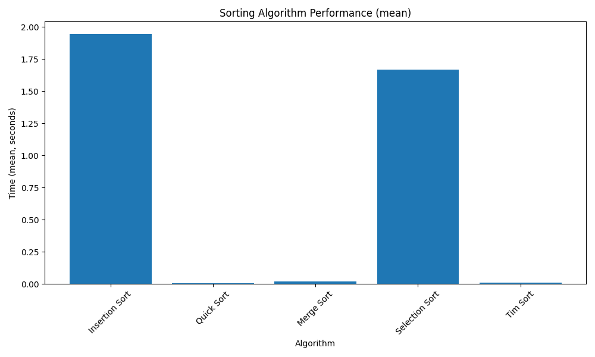
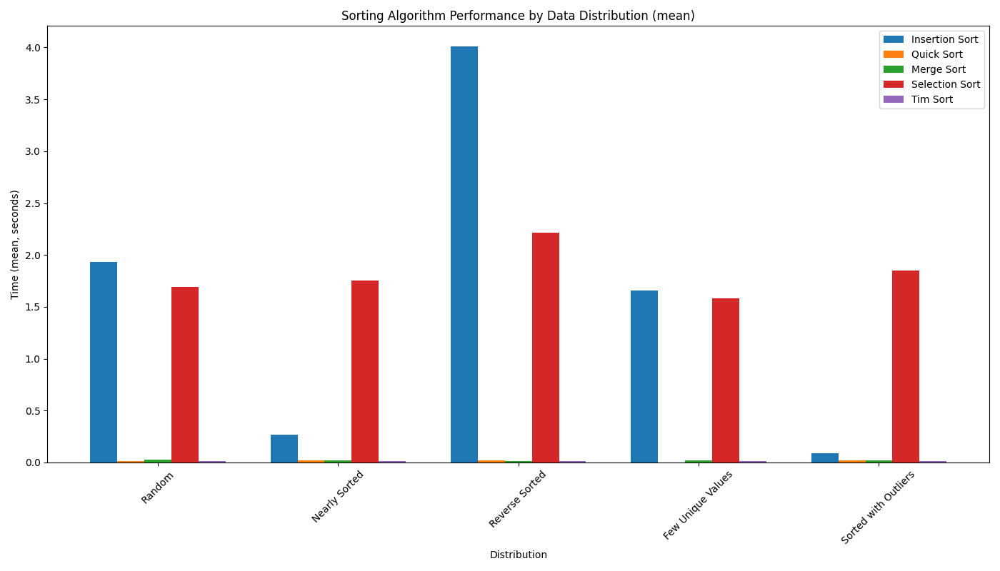

# Sorting Algorithm Performance Tests

This module provides a framework for testing and comparing the performance of different sorting algorithms.

## Features

- Test the performance of multiple sorting algorithms on the same input data
- Run multiple tests with different random arrays and calculate average performance
- Generate statistics (min, max, mean, median, standard deviation) for each algorithm
- Visualize results with bar charts
- Compare performance across different array sizes
- Compare performance across different data distributions
- Easily add new sorting algorithms to the test suite

## Usage

### Running the Tests

To run the performance tests:

```bash
python -m sorting_performance.performance_test
```

This will:
1. Generate random arrays of integers
2. Test each sorting algorithm on the same input data
3. Run multiple tests and collect statistics
4. Generate bar charts comparing the performance of each algorithm

### Running Size Comparison Tests

To compare performance across different array sizes:

```bash
python -m sorting_performance.compare_sizes
```

### Running Distribution Comparison Tests

To compare performance across different data distributions:

```bash
python -m sorting_performance.compare_distributions
```

### Running All Tests

To run all tests at once:

```bash
python -m sorting_performance.run_all_tests
```

### Adding New Sorting Algorithms

To add a new sorting algorithm to the test suite:

1. Implement your sorting algorithm in a separate module
2. Import your sorting function in `performance_test.py`
3. Add your sorting function to the `SORTING_ALGORITHMS` dictionary

Example:

```python
# Import your new sorting algorithm
from heap_sort.heap_sort import heap_sort

# Add it to the dictionary of sorting algorithms
SORTING_ALGORITHMS: Dict[str, Callable] = {
    "Insertion Sort": insertion_sort,
    "Quick Sort": quick_sort,
    "Merge Sort": merge_sort,
    "Selection Sort": selection_sort,
    "Heap Sort": heap_sort,  # Add your new algorithm here
}
```

### Customizing Tests

You can customize the tests by modifying the parameters in the `main()` function:

- `array_size`: The size of the random arrays to generate
- `num_tests`: The number of tests to run

For more advanced customization, you can modify the following functions:

- `generate_random_array()`: Change how random arrays are generated
- `run_single_test()`: Run a single test for all algorithms
- `run_multiple_tests()`: Run multiple tests and collect results
- `calculate_statistics()`: Calculate statistics for the test results
- `plot_results()`: Visualize the results

## Output

The test results will be displayed in the console and saved as bar charts in the `sorting_performance/output` directory.

Example console output:

```
Sorting Algorithm Performance Test
=================================

Running 10 tests with arrays of size 10000...

Test 1/10
Insertion Sort: 1.234567 seconds
Quick Sort: 0.012345 seconds
Merge Sort: 0.023456 seconds
Selection Sort: 0.987654 seconds

...

Statistics:

Insertion Sort:
  Min: 1.123456 seconds
  Max: 1.345678 seconds
  Mean: 1.234567 seconds
  Median: 1.234567 seconds
  Standard Deviation: 0.067890 seconds

...

Done! Results have been saved to the sorting_performance/output directory.
```

## Example Visualizations

### Performance Comparison



This chart shows the mean execution time for each sorting algorithm on a random array.

### Size Comparison


This chart compares how each algorithm's performance scales with increasing array size.

### Distribution Comparison



This chart shows how different data distributions affect the performance of each sorting algorithm.

## Requirements

- Python 3.6+
- matplotlib
- statistics (standard library)
- time (standard library)
- random (standard library) 